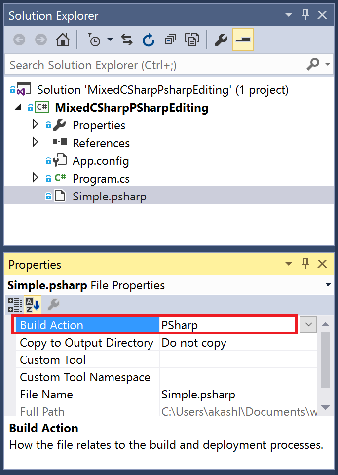

Visual Studio Editing Support
=============================
A useful convention when writing mixed C# and P# programs
is to write all machine and state declarations compactly in P# syntax, and write
the actual event handlers in C# syntax in a C# file to get full use of 
IDE features of VS, including debugging.

**Note:** that the below is required **only** if you want to write a P# program using the high-level syntax. If you simply want to use P# as a C# library, then skip this section and just reference the `Microsoft.PSharp.dll` from your `.csproj` file.

## Prerequisites
Build P# as described [here](../BuildInstructions.md).

## Sample
Set the environment variable `PSharpBinaries` to point to the `Psharp\bin\net462` folder. Then
open `Samples\PingPong\PingPong.MixedMode\PingPong.MixedMode.csproj`.

## Useful Instructions
You will find the following instructions useful. We already follow these in the sample indicated above. These instructions will allow:

- The use of Intellisense in the C# world. You will even see types (such as events, machines, etc.) that were defined in the P# syntax.
- If you make a compilation error in the P# code, Visual Studio will flag it.
- You can build directly from Visual Studio even when including P# code.

## How to use
Update your csproj file to include a reference to `PSharp.targets` as follows:
 
    <!-- This line will already be present towards the bottom of the csproj file -->
    <Import Project="$(MSBuildToolsPath)\Microsoft.CSharp.targets" /> 
    <!-- Insert this line -->
    <Import Project="$(PSharpBinaries)\PSharp.targets" /> 

Change `PSharp.targets` to `PSharp.vs2017.targets` when using VS 2017. Make sure that the environment variable `$(PSharpBinaries)` points to the `PSharp\bin\net462` folder so that it can find the targets file.
 
Mark “Build Action” for all .psharp files to PSharp. See image:

## To keep in mind
If you edit a type in a .psharp file and save the file, it will not automatically show up in the C# world. You’ll need to hit build first (it is fine even if the whole project doesn’t build). In other words, the P#-to-C# translation is not triggered on file edit, but rather only when the project is built.
