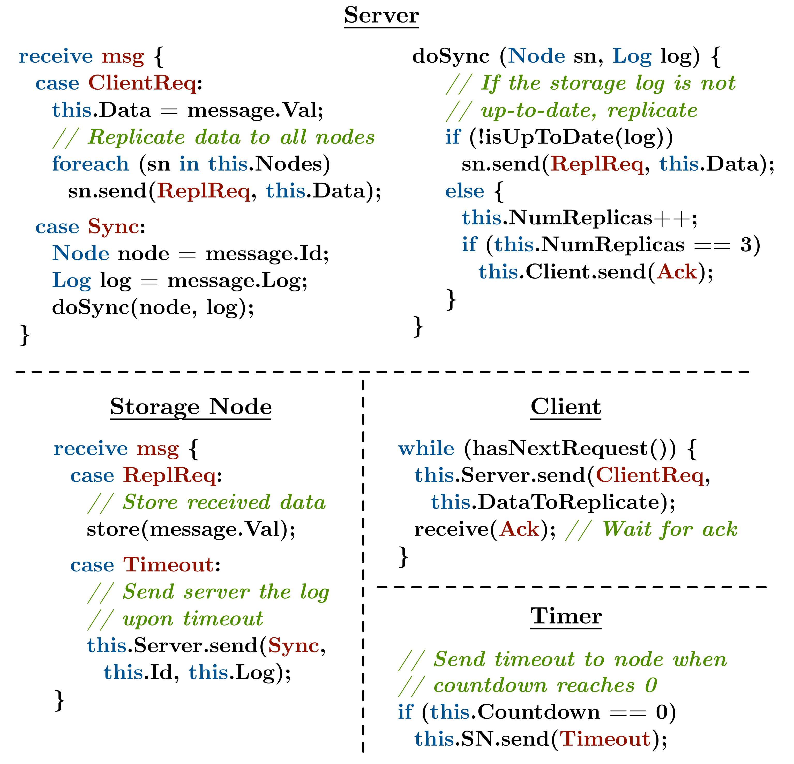
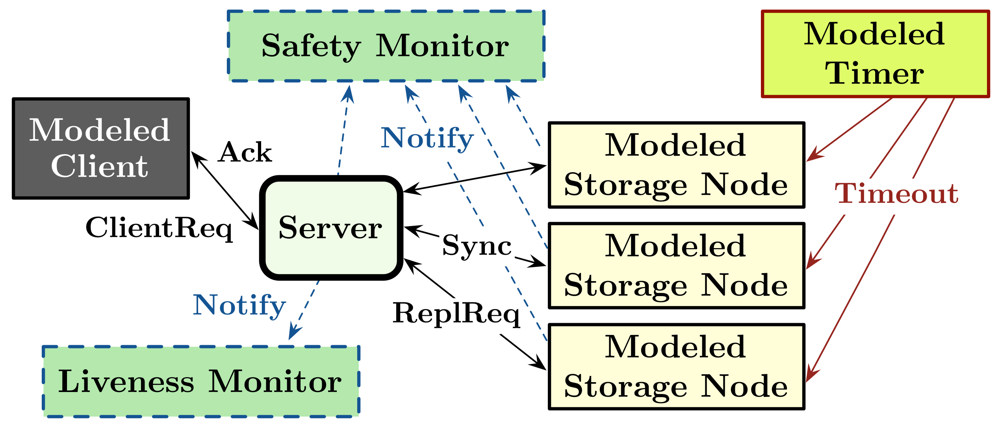

Specifying models and safety/liveness properties
================================================
The following is a discussion of how to model components and the environment of a system using P#, and how to specify safety and liveness properties.

## Modeling system components using P#


The above figure presents the pseudocode of a simple distributed storage system that was contrived for the purposes of explaining our P# testing methodology. The system consists of a client, a server and three storage nodes (SNs). The client sends the server a `ClientReq` message that contains data to be replicated (`DataToReplicate`), and then waits to get an acknowledgement (by calling the `receive` method) before sending the next request. When the server receives `ClientReq`, it first stores the data locally (in the `Data` field), and then broadcasts a `ReplReq` message to all SNs. When an SN receives `ReplReq`, it handles the message by storing the received data locally (by calling the `store` method). Each SN has a timer installed, which sends periodic `Timeout` messages. Upon receiving `Timeout`, an SN sends a `Sync` message to the server that contains the storage log. The server handles the `Sync` message by calling the `isUpToDate` method to check if the SN log is up-to-date. If it is not, the server sends a repeat `ReplReq` message to the outdated SN. If the SN log is up-to-date, then the server increments a replica counter by one. Finally, when there are three replicas available, the server sends an `Ack` message to the client.

There are two bugs in this example. The first bug is that the server does not keep track of unique replicas. The replica counter increments upon each up-to-date `Sync`, even if the syncing SN is already considered a replica. This means that the server might send an `Ack` message when fewer than three replicas exist, which is erroneous behaviour. The second bug is that the server does not reset the replica counter to 0 upon sending an `Ack` message. This means that when the client sends another `ClientReq` message, it will never receive `Ack`, and thus block indefinitely. To systematically test this example, the developer must first create a P# test harness, and then specify the correctness properties of the system.

The following figure illustrates a test harness that can find the above two bugs.



Each box in the figure represents a concurrently running P# machine, while an arrow represents an event being sent from one machine to another. We use three kinds of boxes: (i) a box with rounded corners and thick border denotes a real component wrapped inside a P# machine; (ii) a box with thin border denotes a modelled component; and (iii) a box with dashed border denotes a special P# machine used for safety or liveness checking (see below).

We do not model the server component since we want to test its actual implementation. The server is wrapped inside a P# machine, which is responsible for (i) sending the system messages (as payload of a P# event) via the P# `send(...)` method, instead of the real network, and (ii) delivering received messages to the wrapped component. We model the SNs so that they store data in memory rather than on disk (which can be inefficient during testing). We also model the client so that it can drive the system by repeatedly sending a nondeterministically generated `ClientReq`, and then waiting for an `Ack` event. Finally, we model the timer so that P# takes control of all time-related nondeterminism in the system. This allows the P# testing engine to control when a `Timeout` event will be sent to the SNs during testing, and (systematically) explore different schedules.

P# uses object-oriented language features such as interfaces and dynamic method dispatch to connect the real code with the modelled code. Developers in industry are used to working with such features, and heavily employ them in testing production systems. In our experience, this significantly lowers the bar for engineering teams inside Microsoft to embrace P# for testing.

## Writing safety properties
Safety property specifications generalize the notion of source code assertions; a safety property violation is a finite trace leading to an erroneous state. P# supports the usual assertions for specifying safety properties that are local to a P# machine, and also provides a way to specify global assertions in the form of a _safety monitor_, a special P# machine that can receive, but not send, events.

A safety monitor maintains local state that is modified in response to events received from ordinary (non-monitor) machines. This local state is used to maintain a history of the computation that is relevant to the property being specified. An erroneous global behaviour is flagged via an assertion on the private state of the safety monitor. Thus, a monitor cleanly separates the instrumentation state required for specification (inside the monitor) from the program state (outside the monitor).

The first bug in the above example is a safety bug. To find it, the developer can write a safety monitor that contains a map from unique SN ids to a Boolean value, which denotes if the SN is a replica or not. Each time an SN replicates the latest data, it notifies the monitor to update the map. Each time the server issues an `Ack`, it also notifies the monitor. If the monitor detects that an `Ack` was sent without three replicas actually existing, a safety violation is triggered. The following code snippet shows the P# source code for this safety monitor:
```
monitor SafetyMonitor {
  // Map from unique SNs ids to a boolean value
  // that denotes if a node is replica or not
  Dictionary<int, bool> replicas;

  start state Checking {
    entry {
      var node_ids = (HashSet<int>)payload;
      this.replicas = new Dictionary<int, bool>();
      foreach (var id in node_ids) {
        this.replicas.Add(id, false);
      }
    }
    
    // Notification that the SN is up-to-date
    on NotifyUpdated do {
      var node_id = (int)payload;
      this.replicas[node_id] = true;
    };
    
    // Notification that the SN is out-of-date
    on NotifyOutdated do {
      var node_id = (int)payload;
      this.replicas[node_id] = false;
    };
    
    // Notification that an Ack was issued
    on NotifyAck do {
      // Assert that 3 replicas exist
      assert(this.replicas.All(n => n.Value));
    };
  }
}
```

## Writing liveness properties
Liveness property specifications generalize nontermination; a liveness property violation is an infinite trace that exhibits lack of progress. Typically, a liveness property is specified via a temporal logic formula. We take a different approach and allow the developers to write a _liveness monitor_. Similar to a safety monitor, a liveness monitor can receive, but not send, events.

A liveness monitor contains two special states: the _hot_ and the _cold_ state. The hot state denotes a point in the execution where progress is required, but has not happened yet; e.g. a node has failed, but a new one has not launched yet. A liveness monitor transitions to the hot state when it is notified that the system must make progress. A liveness monitor leaves the hot state and enters the cold state when it is notified that the system has progressed. An infinite execution is erroneous if the liveness monitor stays in the hot state for an infinitely long period of time. Our liveness monitors can encode arbitrary temporal logic properties.

A liveness property violation is witnessed by an _infinite_ execution in which all concurrently executing P# machines are _fairly_ scheduled. Since it is impossible to generate an infinite execution by executing a program for a finite amount of time, our implementation of liveness checking in P# approximates an infinite execution using several heuristics. In this work, we consider an execution longer than a large user-supplied bound as an "infinite" execution. Note that checking for fairness is not relevant when using this heuristic, due to our pragmatic use of a large bound.

The second bug in the above example is a liveness bug. To detect it, the developer can write a liveness monitor that transitions from a hot state, which denotes that the client sent a `ClientReq` and waits for an `Ack`, to a cold state, which denotes that the server has sent an `Ack` in response to the last `ClientReq`. Each time a server receives a `ClientReq`, it notifies the monitor to transition to the hot state. Each time the server issues an `Ack`, it notifies the monitor to transition to the cold state. If the monitor is in a hot state when the bounded infinite execution terminates, a liveness violation is triggered. The following code snippet shows the P# source code for this liveness monitor:
```
monitor LivenessMonitor {
  start hot state Progressing {
    // Notification that the server issued an Ack
    on NotifyAck do {
      raise(Unit);
    };
    on Unit goto Progressed;
  }
  
  cold state Progressed {
    // Notification that server received ClientReq
    on NotifyClientRequest do {
      raise(Unit);
    };
    on Unit goto Progressing;
  }
}
```
