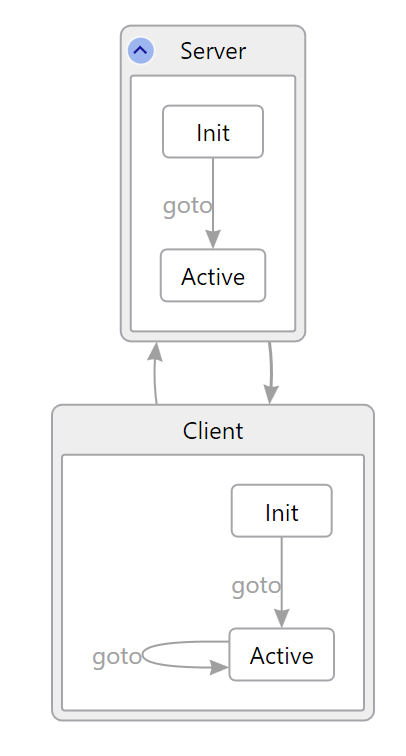

Code and activity coverage
==========================
Standard code coverage tools record the percentage of code lines that are actually executed by test cases. We additionally define the higher-level metric _P# Activity Coverage_ that reports state transitions and the percentage of possible events that are actually executed during a run of `PSharpTester`. 

# PSharpTester coverage options
Running `PSharpTester /?` displays a summary of command-line options. Here is the section describing options to report code and activity coverage:
`````
 ---------------------------
 Testing code coverage options:
 ---------------------------
  /coverage:code         Generate code coverage statistics (via VS instrumentation)
  /coverage:activity     Generate activity (machine, event, etc.) coverage statistics
  /coverage              Generate both code and activity coverage statistics
  /coverage:activity-debug       Print activity coverage statistics with debug info
  /instr:[filespec]      Additional file spec(s) to instrument for /coverage:code; wildcards supported
  /instr-list:[listfilename]     File containing the names of additional file(s), one per line,
         wildcards supported, to instrument for /coverage:code; lines starting with '//' are skipped
`````

The following options from the "basic" section are also relevant:
```
  /test:[assemblyToTest] Path to the P# program to test
  /o:[outputDirectory]   Dump output to directory x (absolute path or relative to current directory
```

Detailed descriptions are provided in subsequent sections; here, we provide an overview to place those sections in context.

* If `/coverage` or `/coverage:code` is specified, all DLLs in the dependency chain between `assemblyToTest` and any `Microsoft.PSharp.*.dll` are instrumented.
* The `/instr` options allow you specify other DLLs that don’t depend on PSharp but should also be instrumented (for example, utility libraries). For the `/instr` options, file resolution (including both the `listfilename` and its contents) is either rooted (absolute) or relative to the path of `assemblyToTest`.
* `/coverage:activity` and `/coverage:activity-debug` do not instrument assemblies; P# maintains the history of events and state transitions for later reporting.

# Output file locations
By default, at the end of testing the report files are written to a directory named `Output\[assemblyToTest]\PSharpTesterOutput` in the same directory as `assemblyToTest`. If `/o:[outputDirectory]` is specified, then the files are written to the directory `[outputDirectory]\PSharpTesterOutput`. In either case, history is retained for up to 10 previous runs:
  * If a directory named `...\PSharpTesterOutput9` exists it is removed.
  * Any directories named `...\PSharpTesterOutput[n]` (for n = 0 to 8) are renamed to `...\PSharpTesterOutput[n+1]`.
  * The new directory `...\PSharpTesterOutput` is created.

Details of the report files that are created for the separate coverage types are provided in subsequent sections.

# Activity coverage 
Activity coverage includes event coverage, which is defined in the following section, as well as a summary of machine states that were entered and exited and which state transitions occurred.

## Definition of event coverage
A tuple `(M, S, E)` is said to be _defined_ if state S of machine M is prepared to receive an event of type E, i.e., it has an action defined for the event. 

A tuple `(M, S, E)` is said to be _covered_ by a test run if state S of machine M actually dequeues an event of type E during an execution.

Event coverage is the number of tuples covered divided by the number of tuples defined in the program. The higher this metric, the better testing exercised asynchrony in the program. As with other coverage metrics, obtaining 100% coverage may be unrealistic as it depends on the particular test harness being used.

## Activity coverage output files
If the option `/coverage`, `/coverage:activity`, or `/coverage:activity-debug` is passed to `PSharpTester`, the following files will be written to the [output directory](#output-file-locations) (for example, using `assemblyToTest` of `PingPong.PSharpLanguage.exe`):
* `PingPong.PSharpLanguage.coverage.txt`. This file contains the Event Coverage metric along with a breakdown per machine and per state. It also summarizes other useful coverage information.
* `PingPong.PSharpLanguage.dgml`. This file contains the Event Coverage visualization as described below.
* `PingPong.PSharpLanguage.sci`. This is the serialized CoverageInfo for the coverage run. 'sci' files from multiple runs can be passed to `PSharpCoverageReportMerger.exe` to create a merged report.
* If `/coverage:activity-debug` was specified, then there will also be a Debug directory containing the same files as above for each process, with the filename qualified by a sequential process id, e.g.:
  * `PingPong.PSharpLanguage.coverage_0.txt`

Note that while `/coverage` is a shortcut for specifying both `/coverage:code` and `/coverage:activity`, `/coverage:activity-debug` must be specified directly.

## Activity coverage visualization example
The activity coverage can additionally be displayed in DGML format. Run `PSharpTester` as described in the [`PSharpTester` examples](#psharptester-examples) section. This produces a file in the DGML format as described in the [activity coverage output files](#activity-coverage-output-files) section. Open the file using Visual Studio. It captures machines, states and transitions witness during the testing of the program. The file also contains inter-machine transitions. These transitions are usually auto-hidden when opened in Visual Studio, but visible when one clicks on a state.



# Code coverage
For code coverage, `PSharpTester` instruments the `assemblyToTest` and the binaries it depends upon via `VSInstr.exe`. `VSPerfCmd.exe` is launched while the test runs, and is terminated when the test is complete.

`VSPerfCmd.exe` collects data from all running processes, so do not run multiple coverage tests at the same time.

## Code coverage binary instrumentation
`PSharpTester` instruments the following binaries (via `VSInstr.exe`):
* `assemblyToTest`: this is the assembly name passed via `/test:[assemblyToTest]`.
* Each DLL in the dependency graph between `assemblyToTest` and a `Microsoft.PSharp.dll`.
* Any additional assemblies specified by one of the `/instr` options.

By default the VS 2017 tools are used. These are set in `PSharpTester.exe.config` and can be overridden by environment variables with the same names as the app settings:
- `VSInstrToolPath`
- `VSPerfCmdToolPath`

## Code coverage output files
If the option `/coverage` or `/coverage:code` is passed to `PSharpTester`, the following files will be written to the [output directory](#output-file-locations) (for example, using `assemblyToTest` of `PingPong.PSharpLanguage.exe`):
* `PingPong.PSharpLanguage.coverage`. This file contains the code coverage data that can be read by Visual Studio. To do so, load it as a file into VS, then select Mixed Debugging.
* `PingPong.PSharpLanguage.instr.exe` and `PingPong.PSharpLanguage.instr.pdb`. These are the instrumented binaries for the `assemblyToTest`.
* The instrumented `.dll` and `.pdb` for each DLL in the dependency graph between `assemblyToTest` and a `Microsoft.PSharp.dll`, as well as any additional assemblies specified by one of the `/instr` options.

The instrumented binaries are retained because VS requires the matching instrumented binaries to be able to load the `.coverage` file. The source code may become out of sync, but the summary information displayed in VS will still be accurate. This allows evaluating the code-coverage impact of changes over time.

# PSharpTester examples
Change to the Samples directory.

First build all the samples as described [here](https://github.com/p-org/PSharp/tree/master/Samples), or only the `PingPong.PSharpLanguage` example: `msbuild PingPong\PingPong.PSharpLanguage`

Then run `PSharpTester.exe` with one of the coverage flags, as well as the other options you want. Here are some minimal examples:
* `..\bin\net462\PSharpTester.exe /i:10 /coverage .\bin\net462\PingPong.PSharpLanguage.exe`
  * This will create the directory `.\bin\net462\Output\PingPong.PSharpLanguage.exe\PSharpTesterOutput`.
  * This generates coverage files for both activity and code coverage. `/coverage` is the equivalent of specifying both `/coverage:code` and `/coverage:activity`.
* `..\bin\net462\PSharpTester.exe /i:10 /coverage:activity .\bin\net462\PingPong.PSharpLanguage.exe /o:C:\PSharp_Coverage\PingPongAsLanguage`
  * This will create the directory `C:\PSharp_Coverage\PingPongAsLanguage\PSharpTesterOutput`.
  * This generates only activity coverage.
* `..\bin\net462\PSharpTester.exe /i:10 /coverage:activity-debug /coverage:code .\bin\net462\PingPong.PSharpLanguage.exe`
  * This generates code and activity coverage, including debug activity output.
