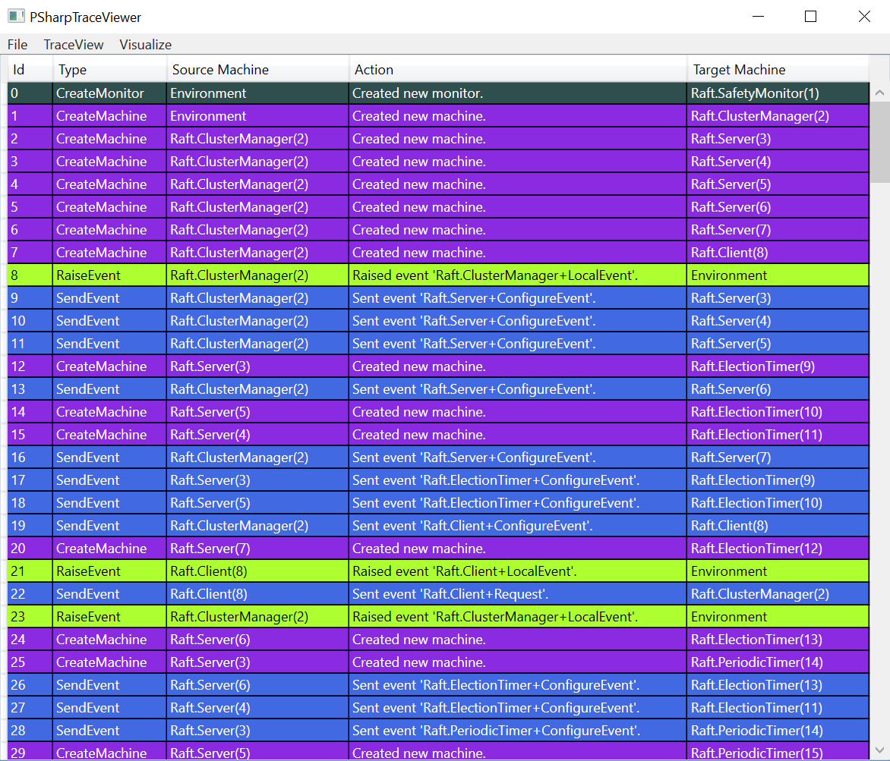
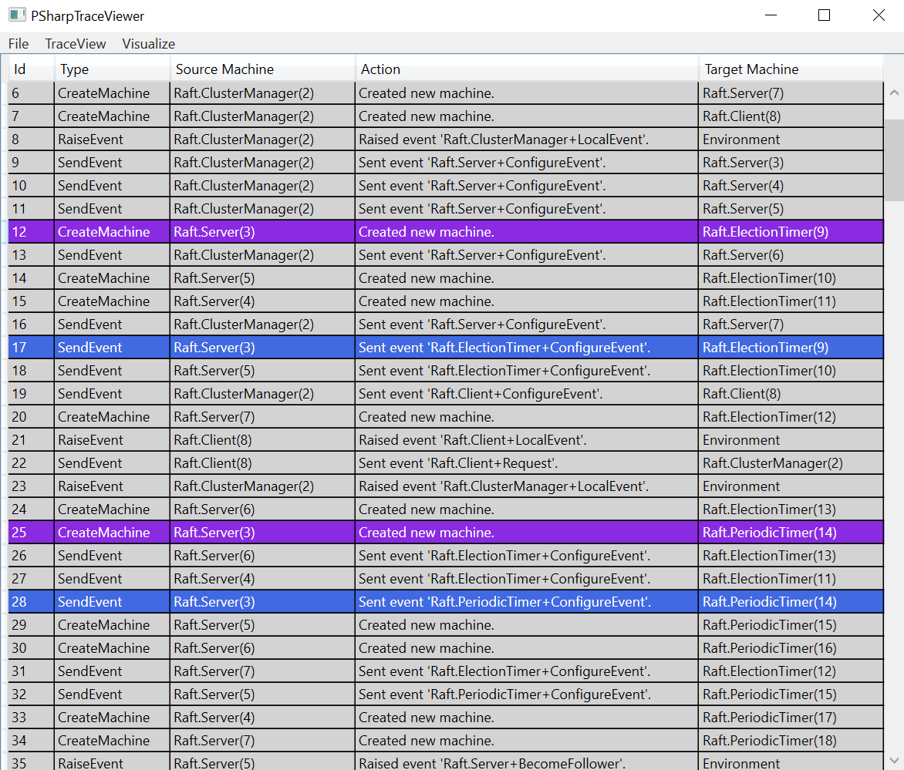
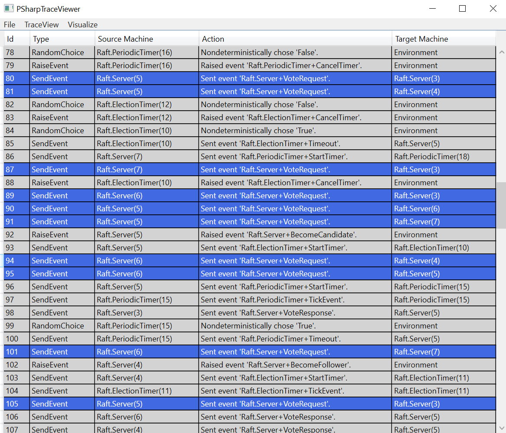
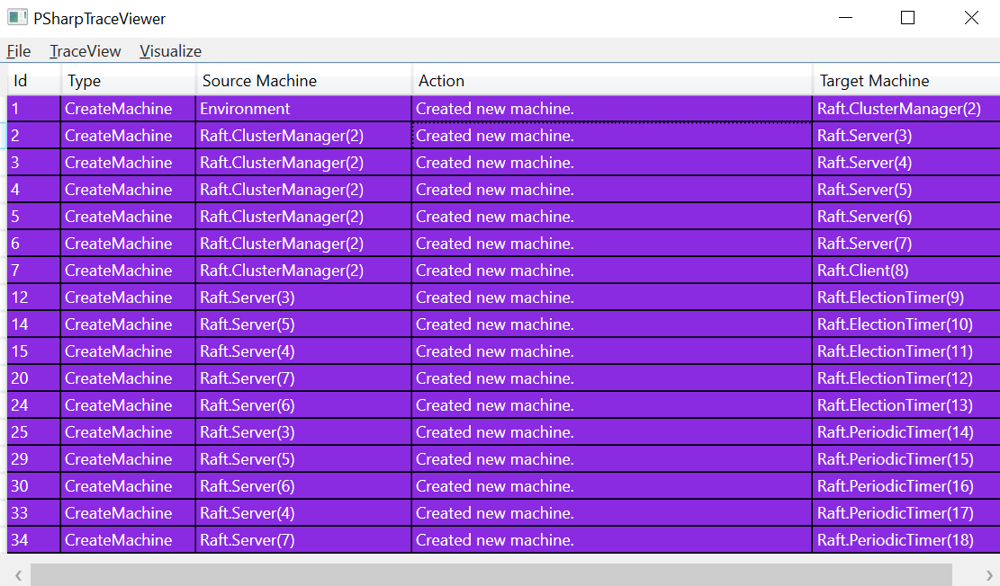

P# Trace Viewer
===============
The P# trace viewer can be used to _view_ and _visualize_ (buggy) execution traces. Its goal is to provide _highly-customizable trace views_ to significantly help the process of debugging your asynchronous application.

To open the trace viewer use the following command:
```
.\PSharpTraceViewer.exe
```

The input to the trace viewer is a `.pstrace` file, which is dumped by the `PSharpTester.exe`. From the `File` menu, choose the trace file to be loaded. The viewer will then populate the _dynamic trace view_.

## Trace Viewing
The dynamic trace view can help you read and make sense of a specified `.pstrace` file. By default it lists all the actions that occurred during the program execution, as seen in the following figure:



### Trace View Focus
You can focus on specific steps of the trace by selecting a cell. The trace viewer will then highlight only the steps that are related to the selection. For example, in the following figure, the trace viewer focuses on any action related to machine `Raft.Server(3)`.



In the following figure, the trace viewer focuses on any action that caused a `VoteRequest` event to be sent.



### Trace Searching
You can use the search text box (Ctrl+F) to find strings in the trace. All rows that do not contain the searched string will fade. By pressing enter you can move to the next row containing the string.

### Trace View Collapse
You are also able to collapse the trace view by selecting a cell and then clicking the `Collapse` menu button. This hides all actions not related to the selected cell, similar to the following figure:



To reset the trace view, click the `Expand` menu button (or click outside the trace view).
